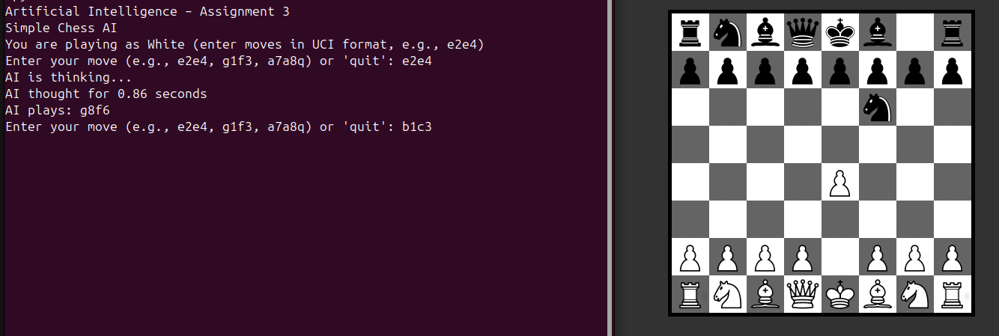

# ♟️ Chess AI with Evaluation Function and Minimax

This project implements a simple **Chess AI** in Python using the `python-chess` library and a custom **evaluation function**.  
The AI uses **Minimax with Alpha-Beta Pruning** to search for the best moves.  

---

## Features

- **Play as White** against an AI that plays as Black.
- **Minimax search** with alpha-beta pruning for efficient decision making.
- **Custom evaluation function**:
  - Material scoring (piece values, bishop pair, penalties for imbalance).
  - Piece-square tables for positional value.
  - Mobility (more legal moves = better).
  - Center control (bonus for occupying central squares).
  - King safety (penalty if king is under attack).
  - Endgame detection (different scoring in late game).
  - Basic pawn-structure rules (no pawns penalty, rook/queen scaling).
- **Interactive board GUI** using `chessboard` package.

---

## The Evaluation Function ( AI thinks using this function )

The AI doesn’t just count pieces—it looks at **multiple chess principles** to decide a good position.

### 1. **Material Score**
- Standard piece values:
  - Pawn = 100  
  - Knight = 320  
  - Bishop = 330  
  - Rook = 500  
  - Queen = 900  
  - King = 20000  
- Adjustments:
  - **Bishop pair bonus** (+20).
  - **Penalty for having no pawns** (harder to win endgames).
  - **Scaling based on pawn count**:
    - Rooks/Queens become less valuable when pawns are crowded.
  - **Endgame tweaks**: fewer pieces = less winning chances.

---

### 2. **Piece-Square Tables**
Each piece has a **piece-square table (PST)** that gives positional bonuses/penalties.  
Examples:
- Knights are better in the center, worse at the edge.
- Pawns are stronger when advanced.
- Kings are safer in the corner during midgame but should be active in the endgame.

---

### 3. **Mobility**
- Bonus for having more legal moves than the opponent.  
- Formula:  
  `score += 2 * (white_moves - black_moves)`

---

### 4. **Center Control**
- Control of squares `d4`, `e4`, `d5`, `e5` gives:
  - +10 for White  
  - -10 for Black  

---

### 5. **King Safety**
- Penalty if king is attacked:
  - `-50 × number_of_attackers`
- Future improvements can add:
  - Pawn shield bonuses.  
  - Penalties for open files near the king.

---

### 6. **Endgame Detection**
- If queens are gone, or only one minor piece remains, the game is treated as **endgame**.  
- King PST switches to encourage centralization.

---

### 7. **Pawn Structure**
- Penalize **no pawns** (endgames become harder).  
- Scaling for **too many pawns** (reduces rook/queen value).  

---

## How It Works

1. **Game loop**:
   - White (human) inputs moves in **UCI format** (e.g., `e2e4`).
   - Black (AI) responds with the best move found by minimax search.

2. **Minimax Algorithm**:
   - Explores possible moves up to a search depth.
   - Alternates between **maximizing (White)** and **minimizing (Black)** players.
   - Uses **alpha-beta pruning** to ignore bad branches.

3. **Evaluation**:
   - If the game is over - return `+/- inf` or `0` for draw.
   - Otherwise - return heuristic score from `evaluate()`.

---

## How to run
  ### Clone
    git clone https://github.com/SriSairam518/AI-assignments

  ### Activate python env
    cd Assignment-3

    python3 -m venv .venv

    source .venv/bin/activate

  ### Install packages
    pip install requirements.txt

    (or)

    pip install python-chess chess-board pygame

  ### Run the file
    python3 chess_game.py

---

# Valakati Sri Sairam
